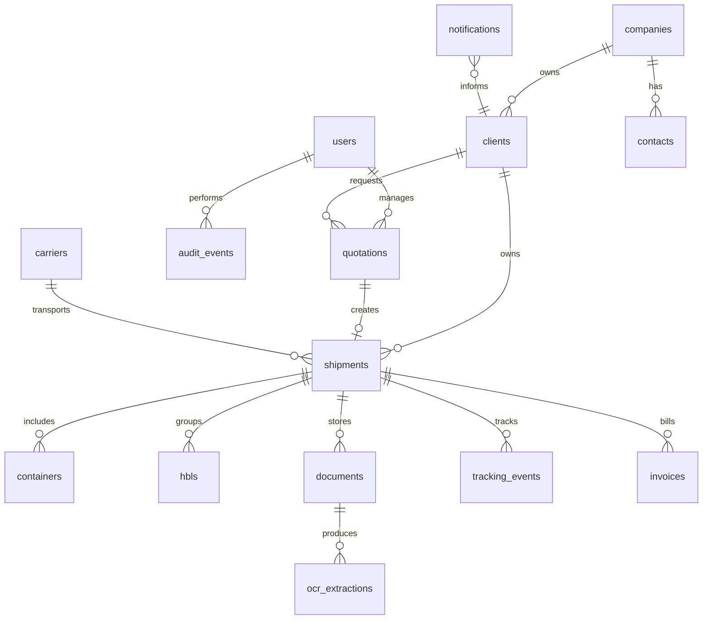

# Modelo Relacional

## Entidades principales

## Tablas

### users

- id UUID PK
- email unique
- password_hash
- full_name
- role
- is_active
- created_at

### audit_events

- id UUID PK
- user_id FK users nullable
- entity_name
- entity_id
- action
- previous_values JSONB nullable
- new_values JSONB nullable
- created_at

### companies

- id UUID PK
- legal_name
- tax_id
- address
- phone
- created_at

### clients

- id UUID PK
- company_id FK
- name
- tax_id
- email
- phone
- status
- created_at

### contacts

- id UUID PK
- company_id FK
- full_name
- email
- phone
- position

### quotations

- id UUID PK
- client_id FK
- requested_by_id FK users
- origin_port
- destination_port
- cargo_description
- incoterm
- status
- estimated_cost
- currency
- created_at
- decided_at

Estados permitidos: `REQUESTED`, `IN_REVIEW`, `APPROVED`, `REJECTED`, `EXPIRED`.

### shipments

- id UUID PK
- client_id FK
- quotation_id FK nullable
- carrier_id FK nullable
- shipment_type
- mbl_number
- vessel_name
- origin_port
- destination_port
- eta
- dta
- cargo_status
- goods_description
- created_at

Estados permitidos: `CREATED`, `DOCUMENT_REVIEW`, `IN_TRANSIT`, `ARRIVED`, `NATIONALIZATION`, `RELEASED`, `CLOSED`.

### hbls

- id UUID PK
- shipment_id FK
- hbl_number
- consignee
- notify_party
- goods_description

### containers

- id UUID PK
- shipment_id FK
- container_number
- container_type
- seal_number
- weight_kg
- status

### documents

- id UUID PK
- shipment_id FK nullable
- document_type
- file_name
- storage_path
- status
- uploaded_by_id FK users
- created_at

Estados permitidos: `UPLOADED`, `OCR_PENDING`, `OCR_PROCESSED`, `VALIDATED`, `REJECTED`, `GENERATED`.

### ocr_extractions

- id UUID PK
- document_id FK
- raw_text
- extracted_data JSONB
- confidence
- validation_status
- validated_by_id FK users nullable
- created_at

### tracking_events

- id UUID PK
- shipment_id FK
- event_type
- description
- event_date
- location
- created_at

### notifications

- id UUID PK
- client_id FK nullable
- shipment_id FK nullable
- notification_type
- subject
- body
- status
- sent_at
- created_at

Estados permitidos: `PENDING`, `SENT`, `FAILED`, `RETRIED`.

### invoices

- id UUID PK
- shipment_id FK
- invoice_number
- amount
- currency
- pdf_document_id FK documents nullable
- created_at
