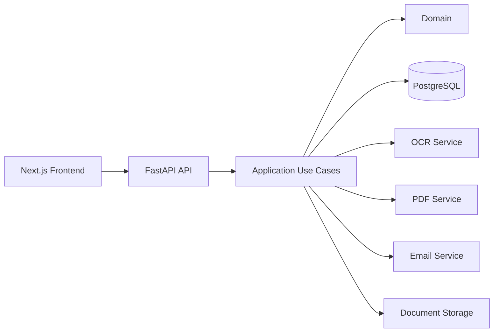
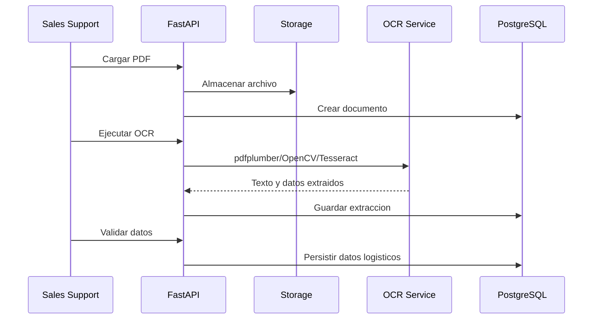
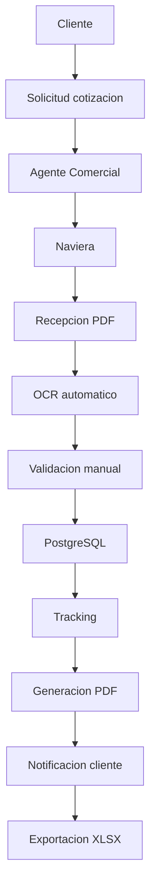
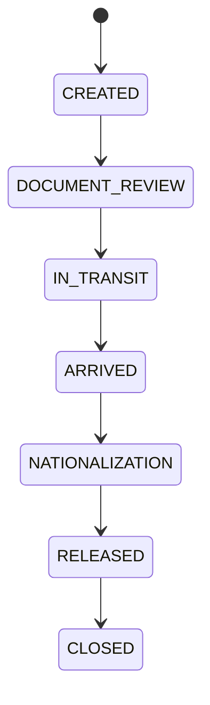
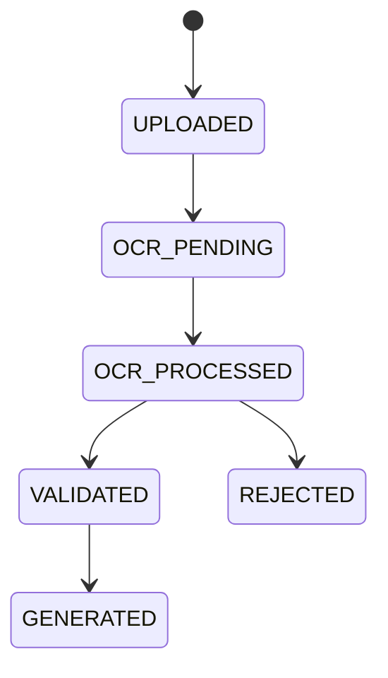

# UML y Flujos

## Componentes

```mermaid
flowchart LR
  UI[Next.js Frontend] --> API[FastAPI API]
  API --> UC[Application Use Cases]
  UC --> D[Domain]
  UC --> DB[(PostgreSQL)]
  UC --> OCR[OCR Service]
  UC --> PDF[PDF Service]
  UC --> MAIL[Email Service]
  UC --> STORE[Document Storage]
```

## Flujo documental OCR

```mermaid
sequenceDiagram
  participant SS as Sales Support
  participant API as FastAPI
  participant Store as Storage
  participant OCR as OCR Service
  participant DB as PostgreSQL

  SS->>API: Cargar PDF
  API->>Store: Almacenar archivo
  API->>DB: Crear documento
  SS->>API: Ejecutar OCR
  API->>OCR: pdfplumber/OpenCV/Tesseract
  OCR-->>API: Texto y datos extraidos
  API->>DB: Guardar extraccion
  SS->>API: Validar datos
  API->>DB: Persistir datos logisticos
```

## Flujo de negocio

```mermaid
flowchart TD
  A[Cliente] --> B[Solicitud cotizacion]
  B --> C[Agente Comercial]
  C --> D[Naviera]
  D --> E[Recepcion PDF]
  E --> F[OCR automatico]
  F --> G[Validacion manual]
  G --> H[PostgreSQL]
  H --> I[Tracking]
  I --> J[Generacion PDF]
  J --> K[Notificacion cliente]
  K --> L[Exportacion XLSX]
```

## Estados de embarque

```mermaid
stateDiagram-v2
  [*] --> CREATED
  CREATED --> DOCUMENT_REVIEW
  DOCUMENT_REVIEW --> IN_TRANSIT
  IN_TRANSIT --> ARRIVED
  ARRIVED --> NATIONALIZATION
  NATIONALIZATION --> RELEASED
  RELEASED --> CLOSED
```

## Estados documentales

```mermaid
stateDiagram-v2
  [*] --> UPLOADED
  UPLOADED --> OCR_PENDING
  OCR_PENDING --> OCR_PROCESSED
  OCR_PROCESSED --> VALIDATED
  OCR_PROCESSED --> REJECTED
  VALIDATED --> GENERATED
```
